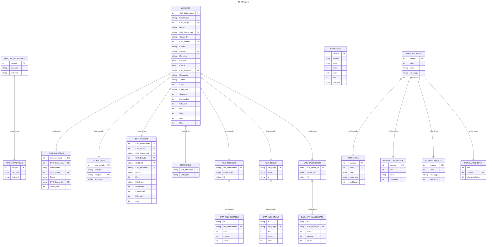

# API with duckdb and fastapi

To run this project make sure to install the requirements with:
```
pip install -r requirements.txt
```

### to run locally
```
uvicorn main:app --reload
```


### To run the tests
```
PYTHONPATH=. pytest tests/tests.py -v
```


## Here is the BD diagram structure, in order to use this project you need to have a similar structure
